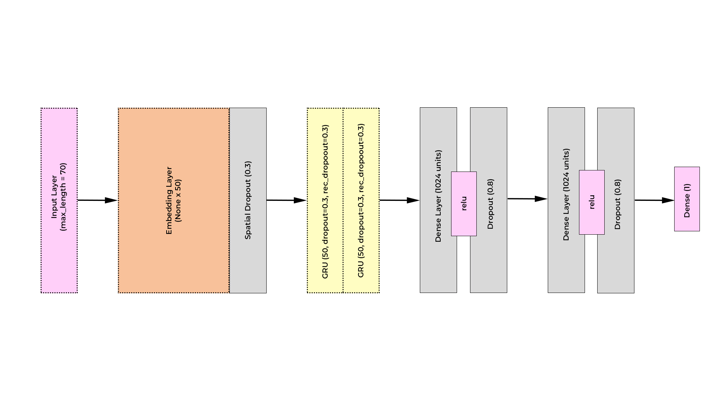

# Twitter Sentiment Analysis

The information flow related to crisis/disasters should give credit to the user generated content on social
media. To leverage the social media data effectively, it is crucial to filter out the noisy information from the
big corpus researchers usually work with. Nowadays, information spreads very quickly on Twitter. This is
a popular social networking service on which members create, post and interact with each other with messages
known as tweets.

# Algorithms

The idea is to classify a tweet as being fake or real given the structure of the content text. 
We used simple machine learning classifiers at first: Logistic Regression, Embedding + double GRUs and then, on the third iteration, 
we scaled to BERT transfer learning. The customized BERT architecture is trained to compare with the simple models aforementioned. Results
show that the customized BERT almost attain the best results. We could not delve deeper into optimizing
BERT, because of low hardware resources (missed training bert on the pretrained bert-large-uncased).

## Double GRUs, first iteration

Recurrent neural network [4] have the ability to take variable length of text sequence but they are extremely
tricky to learn. Hence new types of RNN were deployed like LSTM and GRU. GRU are much simpler in
structure and probably more practical than LSTM. We found that GRUs were effective in the task of sentiment
analysis because of their ability to remember long time dependencies.

<blockquote>
<b>Evaluation</b> This model performed unexpectedly well with a log-loss of 0.403 and f-score of 0.821 on
the validation set and an f-score of 0.6452 on the test set. The epochs run on the unbalanced data-set
and we have chosen that data-set in order to preserve the amount of data we would have lost by doing
under sampling. The total number of epochs desired were 100, but the early stopping condition stalled
at 60, because the model started over-fitting.
</blockquote>

## BERT transfer learning, second iteration

Even though the f-score achieved in the second iteration was not bad, we wanted to see if we could achieve
better evaluation metrics. In this iteration, BERT model is built based on the pytorch-pretrained-bert repository
3. The customized BERT model is built upon bert-base-uncased model, which has 12 transformer
layers, 12 self-attention heads, and with a hidden size 768. We wanted to go even further and try out
bert-large-uncased, but we could not fit in memory even after rigorous optimization steps [see comments in train_bert.py]

The model we implemented is Customized BERT + convolution (BERT+CNN) [3]. It utilizes hidden
states from all the layers of BERT and for each layer a convolution is perform with 16 filters of size (3,
hidden size of BERT). The output channels are concatenated together. We do a max-pooling to squeeze
the convolution output into a 1D vector, which is then linked to a fully connected Dense layer to perform
softmax.

<blockquote><b>Experimental details:</b> Desired batch size is 32. Initial learning rate is set to 0.001 for non-BERT parameters
and 0.00002 for BERT parameters as suggested by [https://arxiv.org/abs/1810.04805]. If the model doesn’t
get better after a patience of 5 (5 epochs), the learning rate decays by 50%. The maximum number of
learning rate decay trials is 5 before we begin the process of earlystopping. We used Adam optimizer and
cross entropy as our loss function.</blockquote>
